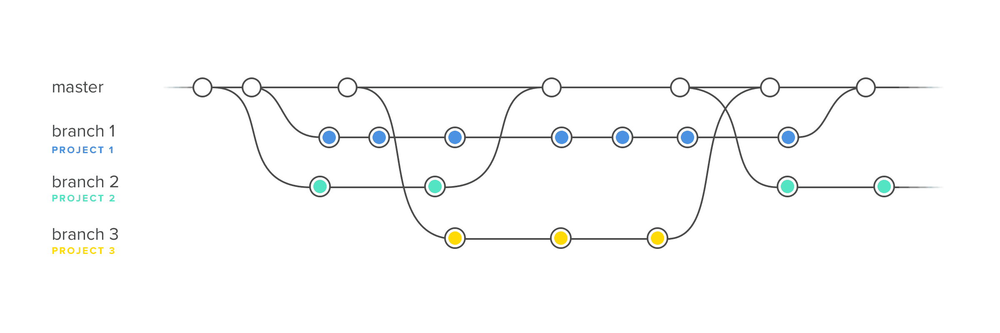
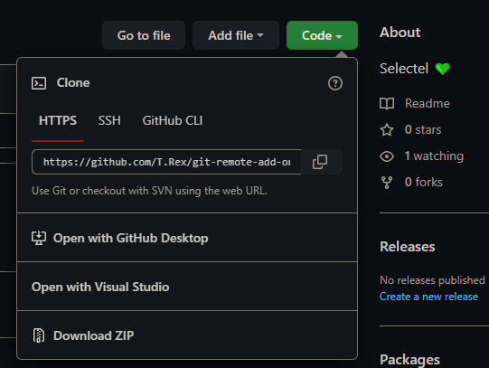
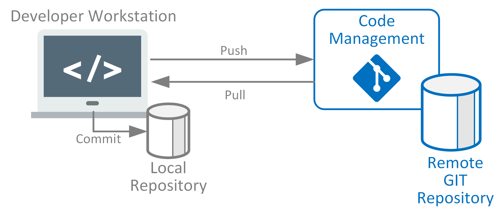

## Ссылки

-   [Markdown](https://github.com/adam-p/markdown-here/wiki/Markdown-Cheatsheet)
-   [Ветвление](https://git-scm.com/book/ru/v2/%D0%92%D0%B5%D1%82%D0%B2%D0%BB%D0%B5%D0%BD%D0%B8%D0%B5-%D0%B2-Git-%D0%9E-%D0%B2%D0%B5%D1%82%D0%B2%D0%BB%D0%B5%D0%BD%D0%B8%D0%B8-%D0%B2-%D0%B4%D0%B2%D1%83%D1%85-%D1%81%D0%BB%D0%BE%D0%B2%D0%B0%D1%85)
-   [Ассиметричное шифрование](https://encyclopedia.kaspersky.ru/glossary/asymmetric-encryption/)
-   [Перенос ключей между компьютерами](https://btip.ru/perenos-klyuchej-ssh-s-odnogo-kompyutera-na-drugoj/)

## Этапы работы

1.  **Подготовительный этап**
    -   (только для Windows) установка GIT на компьютер [https://git-scm.com/downloads](https://git-scm.com/downloads)
    -   настройка Git на компьютере:
        -   `git config --global -l` посмотреть текущие настройки
        -   `git config --global user.name "Ivan Ivanov"` настройка имени
        -   `git config --global user.email "my_email@example.org"` настройка email
    -   наличие аккаунта на GitHub
    -   выгрузить публичный ключ на GitHub
        -   просмотр публичного ключа (если ошибка, то надо сгенерировать)
            -   `cat ~/.ssh/id_ed25519.pub`
            -   `cat ~/.ssh/id_rsa.pub`
        -   `ssh-keygen -t ed25519 -C 'email@example.org'` сгенирировать пару ключей (ВЫПОЛНИТЬ ТОЛЬКО В НАЧАЛЕ КАРЬЕРЫ)
        -   скопировать публичный ключ на GitHub
        -   `ssh -T git@github.com` проверить, что ключ выгружен на GitHub

## Проверка текущей версии Git

```bash
# открыть GitBash (Windows)
git -v
git --version
```

## GIT (2005)



**Что это?**

-   Система контроля версий
-   Хранилище
-   Машина времени
-   Умная система управления кодом проекта
-   Содержит все файлы проекта
-   Своебразная БД, т.е. хранит в структурированном виде
-   Можно восстановить предыдущие версии файлов
-   Есть обмен версиями между разработчиками
-   Проверка целостности (контрольные суммы, хеш-суммы – если быть точным) – надежная система

## Git: эко-система

1.  **Git** - прикладная программа - дополнительным инструментом любого разработчика
2.  **GitHub** - интернет-площадка
3.  **GitHub Pages** - бесплатный хостинг (`html/css/js`)

### Основные способы авторизации в Интернет

1.  **По паролю**
2.  **По публичному ключу**

-   используют в профе. среде
-   позволяет выполнять авторизацию без пароля (прозрачно)
-   подразумевает наличие пары ключей
    -   **публичный (public)** - можно делиться со всеми
    -   **приватный (private)** - храним в секрете

## Виды программных интерфейсов

1.  `GUI` (Graphical User Interface) - графический интерфейс пользователя
2.  `CLI` (Command Line Interface) - интерфейс командной строки

## Необходимые знания для работы в команде (Git/GitHub)

1.  Освоить базовый порядок работы с Git/GitHub
2.  Освоить механизм ветвления
3.  Освоить модели совместной разработки

## Базовые понятия

-   **проект** - каталог с файлами исходного кода (кодовая база)
-   **репозиторий** - хранилище истории разработки проекта
-   **коммит (как объект)** - точка сохранения проекта (снимок снимать)

## Базовый (основной) порядок работы с Git/GitHub

1.  **Подключения Git к проекту / инициализация нового репозитория**
    
    -   `git init`
    -   создается “скрытое хранилище” - каталог `.git/`
    -   выполнять только для новых проектов
2.  **Сохранение**
    
    -   индексация файлов (добавить в очередь на сохранение)
        -   `git add .`
    -   фиксация (сохранение как таковое)
        -   `git commit -m 'описание изменений'`
3.  **Создание нового репо на GitHub**
    
4.  **Привязка репо `LOCAL ↔ REMOTE`**
    
    1.  `git remote add origin скопированная_ссылка`
        
        
        
5.  **Выгрузка ветки на GitHub**
    
    -   `git push -u origin название_ветки` (`main`, `master` и т.д.)
    -   `git push -u origin main` (пример)
    -   `git push` (если ветку уже выгружал)

## Стандартная последовательность команд

```bash
git add .
git commit -m 'update'
git push
```

## Просмотр текущей привязки

## Файл `README.md`

-   использует формат `Markdown`
-   описание репо на **GitHub**
-   помещается в корень проекта, как правило

**Пример**

## Ветвление в Git

-   Ветка - еще одна версия проекта (изолированный поток разработки)


### Стратегии ветвления в Git

1.  **Git Flow**
    
    1.  `main/master/stable` - long-term (только для проверенного, оттестированного кода - “**священный грааль**”)
    2.  `develop/current` - long-term (для тестирования, текущая разработка)
    3.  `login/bugfix1/payments` - short-term
2.  **GitHub Flow**
    
    1.  `main/master/stable` - long-term
    2.  `login/bugfix1/payments` - short-term
    
    ## Работа с ветками
    
    ### 1\. Просмотр списка веток (версий)

    ```bash
    git branch
    git branch -avv # подробный вывод
    ```
    
    ### 2\. Создание новой ветки (от текущей)

    ```bash
    git branch название_ветки # от текущей ветки
    git branch название_ветки main # от main
    ```
    
    ### 3\. Переключение на другую ветку

    ```bash
    # только после сохранения всех изменений
    git checkout название_ветки
    git checkout - # переключиться на предыдущую
    ```
    
    ### 4\. Создать ветку и переключиться (одной командой)

    ```bash
    git checkout -b new_branch # от текущей ветки
    git checkout -b new_branch main # от main
    ```
    
    ### 5\. Выгрузка ветки на GitHub

    ```bash
    git push -u origin название_ветки
    ```
    
    ### 6\. Удаление локальной ветки (!)
    
    ```bash
    # предварительно уйти с удаляемой ветки
    git branch -D название_ветки
    git branch -D ветка_1 ветка_2 ветка_3 # сразу несколько
    ```
    
    ### 7\. Удаление дистанционной ветки (!)

    ```bash
    git push origin --delete название_ветки
    git push origin --delete ветка_1 ветка_2 ветка_3 # сразу несколько
    ```
    
    ### 8\. Переименование текущей локальной ветки
    
    ```bash
    # только после сохранения всех изменений
    git branch -m новое_название
    ```
    
    ### 9\. Слияние веток
    
    -   перенос (интеграция) изменений из одной ветки в другую
    -   сохранить все изменения перед слиянием
    -   перед слиянием необходимо переключиться на целевую ветку
    
    ```bash
    # только после сохранения всех изменений
    git merge название_ветки_откуда_взять_улучшения
    ```
    
    ## Клонирование репозитория
    
    -   скачивание репо с **GitHub**
    -   Для редактора `VSCODE`:
        -   `CTRL + SHIFT + P`
        -   написать `gitcl`
        -   выбрать **`Git Clone`**
        -   вставить скопированную ссылку
        -   выбрать место, куда скачать репо
    
    
    
    ## Выгрузить изменения с GitHub
    
    ## Схема работы `LOCAL ↔ REMOTE`
    
    
    
    ## Состояния файлов в Git
    
    1.  Отслеживаемые
    2.  Неотслеживаемые (по умолч.)
    3.  Игноририруемые
    
    ## Просмотр состояния рабочего каталога
    
    ```bash
    git status
    git status -s # сжатый вывод
    ```
    
    ## Легенда (маркеры) `git status -s`
    
    -   `??` Untracked
    -   `M` Modified
    -   `D` Deleted
    -   `R` Renamed
    -   `A` Added
    
    **красный цвет** - не проиндексирован
    
    **зеленый цвет** - проиндексирован (добавлен в очередь на коммит)
    
    ## Очистить индекс
    ```bash
    git reset # полностью
    git reset filename # очистить только один файл
    git reset -- filename # очистить только один файл (без удаления из рабочего каталога)       
    ```
    
    ## Избирательное добавление в индекс
    ```bash
    git add filename # добавить только один файл
    git add . # добавить все файлы в текущем каталоге
    git add filename1 filename2 # добавить несколько файлов
    git add -u # добавить все измененные файлы в текущем каталоге
    git add -p # пошаговое добавление изменений в индекс
    ```
